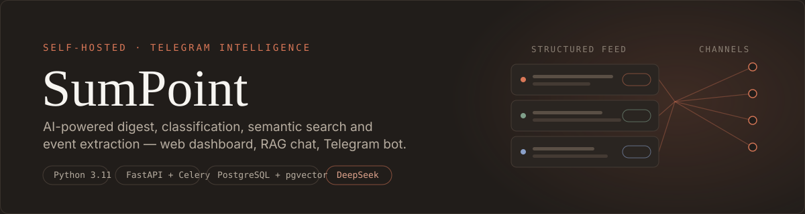
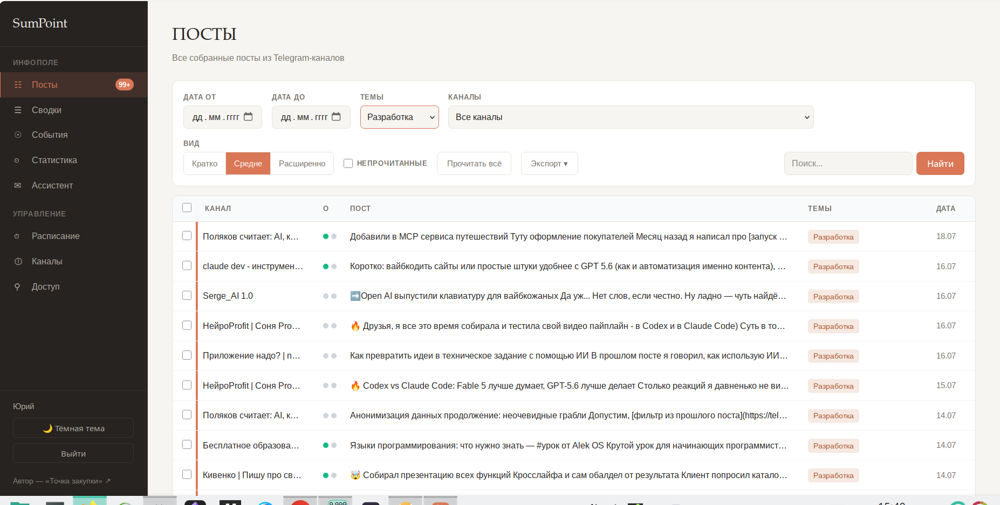
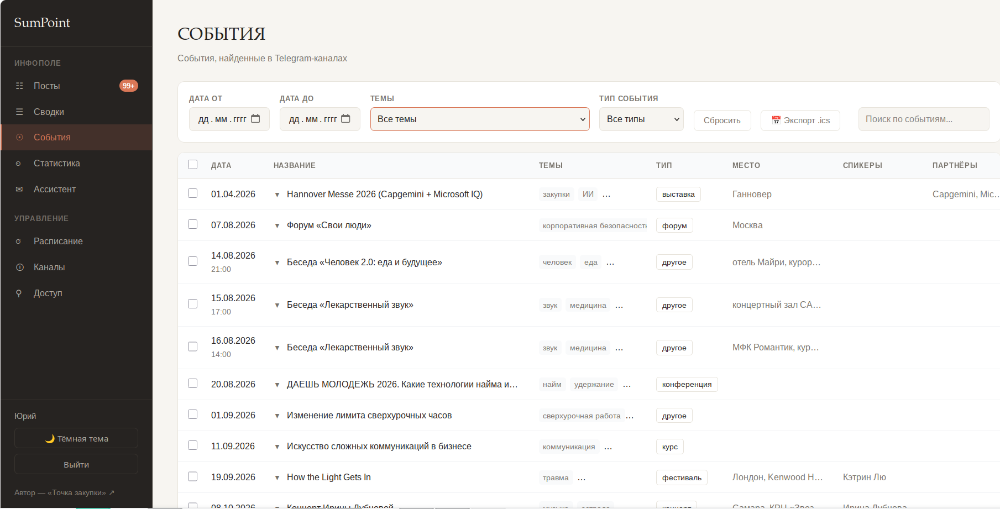
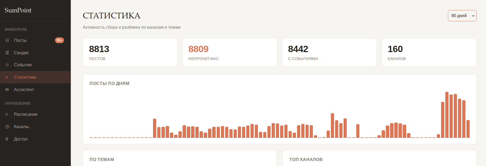
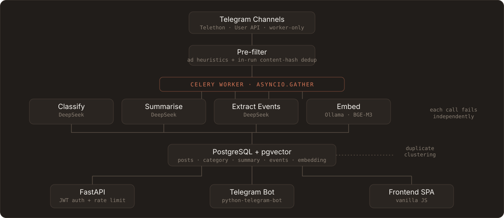

<div align="center">
  
</div>

<p align="center">
  <a href="https://github.com/Yuraberg/SumPoint/actions/workflows/deploy.yml"></a>
  
  
</p>

<p align="center">
  <a href="#english">🇬🇧 English</a> · <a href="#russian">🇷🇺 Русский</a>
</p>

---

<a name="english"></a>

## 🇬🇧 English

SumPoint connects to your Telegram channel subscriptions, filters out ads and duplicate reposts, and turns the noise into a structured feed: category labels, 1–3 sentence summaries, an upcoming-events calendar, keyword alerts, and scheduled digests — delivered via a web dashboard and a Telegram bot.

### Contents

- [Screenshots](#-screenshots)
- [Features](#-features)
- [Architecture](#-architecture)
- [Quick Start](#-quick-start)
- [Project Structure](#-project-structure)
- [Security](#-security)
- [Monitoring & Ops](#-monitoring--ops)
- [Prompt Engineering](#-prompt-engineering)
- [License](#-license)

### 📷 Screenshots

| Post feed | Events | Statistics |
|---|---|---|
|  |  |  |

The feed supports filters by date/channel/topic, three density levels, full-text and
semantic search, read tracking, and row checkboxes for CSV/JSON export. The Events tab
can search by name/location/speaker and export the selected events to `.ics` for your
calendar. The UI defaults to English, with a one-click switch to Russian.

---

### ✨ Features

| Feature | Description |
|---|---|
| **AI Classification** | Every post is tagged into a category (Рынок, Технологии, События…) by DeepSeek |
| **Smart Summarisation** | 1–3 sentence summaries that preserve key facts and numbers |
| **Event Extraction** | Dates, times, event names and links pulled out into a calendar view, with a text search over the extracted events and selective `.ics` export |
| **Favorites** | Bookmark posts and calendar events with one tap, browsed in a dedicated tab grouped by topic — from the web dashboard or the bot |
| **Semantic Search** | Find posts by meaning, not just keywords, via BGE-M3 embeddings + pgvector cosine search |
| **RAG Assistant** | Chat with your own feed — retrieves the most relevant posts and asks DeepSeek to answer with `[N]` citations back to the source |
| **Duplicate Clustering** | Reposts of the same story across channels are grouped ("также в N каналах") via pgvector nearest-neighbour search |
| **Keyword Alerts** | Get pinged the moment a channel posts something matching a word you're watching |
| **Custom Schedules** | Cron-based per-topic digests, not just the two default daily slots |
| **Analytics Dashboard** | Post volume over time, per-category and top-channel breakdowns, unread/event counts |
| **Selective Export** | Check just the rows you want on the Posts/Events tables and export only those — CSV/JSON for posts, `.ics` for events |
| **Telegram Bot** | Morning/evening digest delivery, category filters, one-tap channel management |
| **Web Dashboard** | Dark-mode SPA: post feed, digest view, events calendar, analytics, RAG chat, channel manager |
| **Ad & Dupe Filtering** | Keyword-based ad heuristics + content-hash dedup across reposts |
| **Access Control** | Invite-code / owner-approval gate on signup — new users land in a pending state until approved |

---

### 🏗 Architecture

<p align="center">
  
</p>

Redis backs both the Celery broker/result store and a distributed lock that
paces the continuous fetch loop so it never bursts through every channel at
once (flood-ban avoidance) and never runs two overlapping fetch cycles.

**Why Telethon only runs in the worker:** Telegram's User API bans a session
that's used from two IPs at once, so all Telethon calls are dispatched from
the API container to the worker via Celery — the API process never touches
Telethon directly.

---

### 🚀 Quick Start

#### 1. Clone & configure

```bash
git clone https://github.com/Yuraberg/SumPoint.git
cd SumPoint
cp .env.example .env
# Fill in .env with your keys (see below)
```

#### 2. Required credentials

| Variable | Where to get it |
|---|---|
| `TELEGRAM_API_ID` / `TELEGRAM_API_HASH` | [my.telegram.org](https://my.telegram.org) → API development tools |
| `TELEGRAM_SESSION_STRING` | Run `python generate_session.py` once, locally |
| `TELEGRAM_BOT_TOKEN` | [@BotFather](https://t.me/BotFather) → `/newbot` (same bot used for the Login Widget) |
| `DEEPSEEK_API_KEY` | [platform.deepseek.com](https://platform.deepseek.com) |
| `OLLAMA_BASE_URL` | URL of an Ollama instance serving `bge-m3` (for embeddings) |
| `SESSION_ENCRYPTION_KEY` | `openssl rand -hex 32` |
| `SECRET_KEY` | `openssl rand -hex 32` |

See `.env.example` for the full list, including optional ones (`SENTRY_DSN`, `UPTIME_KUMA_PUSH_URL`, digest schedule hours, fetch pacing).

#### 3. Run with Docker Compose

```bash
docker compose up -d
```

- Web dashboard + API: `http://localhost:8001`
- API docs: `http://localhost:8001/docs`
- Health check: `http://localhost:8001/api/v1/health`

For production, layer the hardened overrides (no source mounts, resource limits, no published DB/Redis ports):

```bash
docker compose -f docker-compose.yml -f docker-compose.prod.yml up -d
```

#### 4. Run locally (development, without Docker)

```bash
python -m venv .venv
source .venv/bin/activate        # Windows: .venv\Scripts\activate
pip install -r requirements.txt

docker compose up -d db redis    # infrastructure only
alembic upgrade head

uvicorn app.main:app --reload                                # API
celery -A app.tasks.celery_app worker --loglevel=info         # separate terminal
celery -A app.tasks.celery_app beat --loglevel=info           # separate terminal
python -m bot.bot                                             # separate terminal
```

---

### 📁 Project Structure

```
SumPoint/
├── app/
│   ├── api/            # FastAPI routers (auth, admin, channels, posts, digest, chat, stats, schedule, health)
│   ├── models/          # SQLAlchemy models (User, Channel, Post, Schedule, KeywordAlert, MagicLink, InviteCode)
│   ├── repositories/     # Query layer, one module per aggregate
│   ├── schemas/           # Pydantic request/response models
│   ├── prompts/            # DeepSeek prompt templates (classification, summarisation, events)
│   ├── services/            # AI engine, Telegram ingestion, clustering, encryption, digest assembly, RAG
│   └── tasks/                # Celery tasks (fetch, digest scheduling, maintenance)
├── bot/                # Telegram bot (python-telegram-bot)
│   └── handlers/       # /start, digest, settings, search, alerts, access, recent-posts
├── frontend/           # Single-page web dashboard (vanilla JS, no build step)
├── alembic/            # Database migrations (schema is Alembic-owned, not app-managed)
├── scripts/            # backup-db.sh / restore-db.sh
├── tests/              # unit + integration (real Postgres/pgvector) suites
├── docker-compose.yml         # development
├── docker-compose.prod.yml    # production overrides
└── .env.example
```

---

### 🔐 Security

- Telegram session strings encrypted at rest with **AES-256-GCM**
- Auth via **Telegram Login Widget** (HMAC-verified, timing-safe compare) or bot-issued magic links, both exchanged for a **JWT** delivered as an HttpOnly, `SameSite=Lax`, `Secure` cookie — never touched by frontend JS, so XSS can't exfiltrate it
- **Access control**: new signups land in a pending state until an owner approves them or redeems a single-use invite code; every business endpoint is gated on `is_approved`
- Per-endpoint **rate limiting** (`slowapi`), Redis-backed, keyed off the real client IP behind the Caddy reverse proxy (last `X-Forwarded-For` hop, not the first — the first is client-spoofable)
- Security headers on every response: CSP (no `unsafe-inline`), `X-Frame-Options`, HSTS, `Referrer-Policy`, `Permissions-Policy`
- Dependencies scanned with `pip-audit` on every CI run
- Optional **Sentry** integration for error tracking (no-op unless `SENTRY_DSN` is set)

### 📊 Monitoring & Ops

- `GET /api/v1/health` — deep health check (DB `SELECT 1` + Redis `PING`), meant for Uptime Kuma
- `GET /api/v1/health/fetch` — fetch-pipeline freshness check, catches a wedged worker/beat even when the API and worker heartbeat both still look green
- Celery worker heartbeat pushed to Uptime Kuma every 5 minutes when `UPTIME_KUMA_PUSH_URL` is set
- Every request gets a `request_id`, echoed in the `X-Request-ID` response header and stitched into JSON logs, so a bug report can be traced back to exact log lines
- `scripts/backup-db.sh` / `scripts/restore-db.sh` for pg_dump-based backup and restore; deploy pipeline keeps the nightly backup cron installed on the host
- CI (`.github/workflows/deploy.yml`) runs lint + `pip-audit` + unit tests on every PR, runs integration tests against a real Postgres/pgvector service container, and deploys via SSH on merge to `main` — with an automatic rollback to the previous commit if the post-deploy health check fails

---

### 🤖 Prompt Engineering

All DeepSeek prompts (`app/prompts/`) follow a consistent structure:

- **Role Prompting** — a defined persona per task (classifier, summariser, event extractor)
- **Delimiters** — `###` and `"""` separate instructions from post content
- **Chain-of-Thought** — a `<thought>` block for pre-analysis, stripped before the result is stored or shown
- **Few-Shot** — annotated examples in the classification prompt

---

### 📄 License

**© 2026 Yuraberg. All rights reserved.**

This software is proprietary. No use, copying, modification, or distribution
is permitted without prior written authorization from the copyright holder —
see [LICENSE](LICENSE) for the full terms.

---

<a name="russian"></a>

## 🇷🇺 Русский

SumPoint подключается к вашим подпискам на Telegram-каналы, отфильтровывает рекламу и повторяющиеся репосты, и превращает шум в структурированную ленту: метки категорий, краткие содержания в 1–3 предложения, календарь предстоящих событий, оповещения по ключевым словам и дайджесты по расписанию — доступные через веб-дашборд и Telegram-бота.

### Содержание

- [Скриншоты](#-скриншоты)
- [Возможности](#-возможности)
- [Архитектура](#-архитектура)
- [Быстрый старт](#-быстрый-старт)
- [Структура проекта](#-структура-проекта)
- [Безопасность](#-безопасность)
- [Мониторинг и эксплуатация](#-мониторинг-и-эксплуатация)
- [Промпт-инжиниринг](#-промпт-инжиниринг)
- [Лицензия](#-лицензия)

### 📷 Скриншоты

| Лента постов | События | Статистика |
|---|---|---|
|  |  |  |

Лента поддерживает фильтры по дате/каналу/теме, три уровня плотности отображения,
полнотекстовый и семантический поиск, отметку прочитанного и чекбоксы для
экспорта в CSV/JSON. Вкладка «События» умеет искать по названию/месту/спикеру
и экспортировать выбранные события в `.ics` для вашего календаря. По умолчанию
интерфейс на английском, переключение на русский — в один клик.

---

### ✨ Возможности

| Функция | Описание |
|---|---|
| **AI-классификация** | Каждый пост размечается по категории (Рынок, Технологии, События…) с помощью DeepSeek |
| **Умное реферирование** | Краткое содержание в 1–3 предложения с сохранением ключевых фактов и цифр |
| **Извлечение событий** | Даты, время, названия событий и ссылки попадают в календарь, с текстовым поиском по извлечённым событиям и выборочным экспортом в `.ics` |
| **Избранное** | Сохраняйте посты и события в один тап, просматривайте их на отдельной вкладке с группировкой по темам — из веб-дашборда или из бота |
| **Семантический поиск** | Поиск постов по смыслу, а не только по ключевым словам, через эмбеддинги BGE-M3 и косинусный поиск pgvector |
| **RAG-ассистент** | Общайтесь со своей лентой — ассистент находит наиболее релевантные посты и просит DeepSeek ответить со ссылками `[N]` на источник |
| **Кластеризация дублей** | Репосты одной и той же новости из разных каналов группируются («также в N каналах») через поиск ближайших соседей pgvector |
| **Оповещения по ключевым словам** | Уведомление сразу, как только в канале появляется пост с отслеживаемым словом |
| **Настраиваемые расписания** | Дайджесты по cron-расписанию для отдельных тем, а не только два стандартных ежедневных слота |
| **Дашборд аналитики** | Объём постов во времени, разбивка по категориям и топ-каналам, счётчики непрочитанного и событий |
| **Выборочный экспорт** | Отметьте нужные строки в таблицах постов/событий и экспортируйте только их — CSV/JSON для постов, `.ics` для событий |
| **Telegram-бот** | Утренняя/вечерняя доставка дайджеста, фильтры по категориям, управление каналами в один тап |
| **Веб-дашборд** | SPA в тёмной теме: лента постов, вид дайджеста, календарь событий, аналитика, RAG-чат, менеджер каналов |
| **Фильтрация рекламы и дублей** | Эвристики по ключевым словам для рекламы + дедупликация по хэшу контента среди репостов |
| **Контроль доступа** | Доступ по инвайт-коду / одобрению владельца при регистрации — новые пользователи попадают в состояние ожидания до одобрения |

---

### 🏗 Архитектура

<p align="center">
  
</p>

Redis выступает и брокером/хранилищем результатов Celery, и распределённой
блокировкой, которая сдерживает темп непрерывного цикла загрузки постов, чтобы
он никогда не проходил все каналы разом (риск флуд-бана) и никогда не запускал
два пересекающихся цикла загрузки одновременно.

**Почему Telethon работает только в воркере:** User API Телеграма банит сессию,
если она используется с двух IP одновременно, поэтому все вызовы Telethon
отправляются из API-контейнера в воркер через Celery — процесс API никогда не
обращается к Telethon напрямую.

---

### 🚀 Быстрый старт

#### 1. Клонирование и настройка

```bash
git clone https://github.com/Yuraberg/SumPoint.git
cd SumPoint
cp .env.example .env
# Заполните .env своими ключами (см. ниже)
```

#### 2. Необходимые учётные данные

| Переменная | Где получить |
|---|---|
| `TELEGRAM_API_ID` / `TELEGRAM_API_HASH` | [my.telegram.org](https://my.telegram.org) → API development tools |
| `TELEGRAM_SESSION_STRING` | Один раз локально выполнить `python generate_session.py` |
| `TELEGRAM_BOT_TOKEN` | [@BotFather](https://t.me/BotFather) → `/newbot` (тот же бот, что используется для Login Widget) |
| `DEEPSEEK_API_KEY` | [platform.deepseek.com](https://platform.deepseek.com) |
| `OLLAMA_BASE_URL` | URL инстанса Ollama с моделью `bge-m3` (для эмбеддингов) |
| `SESSION_ENCRYPTION_KEY` | `openssl rand -hex 32` |
| `SECRET_KEY` | `openssl rand -hex 32` |

Полный список, включая опциональные переменные (`SENTRY_DSN`, `UPTIME_KUMA_PUSH_URL`, часы расписания дайджестов, темп загрузки), см. в `.env.example`.

#### 3. Запуск через Docker Compose

```bash
docker compose up -d
```

- Веб-дашборд + API: `http://localhost:8001`
- Документация API: `http://localhost:8001/docs`
- Health-check: `http://localhost:8001/api/v1/health`

Для продакшена добавьте усиленные оверрайды (без монтирования исходников, с лимитами ресурсов, без публикации портов БД/Redis наружу):

```bash
docker compose -f docker-compose.yml -f docker-compose.prod.yml up -d
```

#### 4. Локальный запуск (разработка, без Docker)

```bash
python -m venv .venv
source .venv/bin/activate        # Windows: .venv\Scripts\activate
pip install -r requirements.txt

docker compose up -d db redis    # только инфраструктура
alembic upgrade head

uvicorn app.main:app --reload                                # API
celery -A app.tasks.celery_app worker --loglevel=info         # отдельный терминал
celery -A app.tasks.celery_app beat --loglevel=info           # отдельный терминал
python -m bot.bot                                             # отдельный терминал
```

---

### 📁 Структура проекта

```
SumPoint/
├── app/
│   ├── api/            # роутеры FastAPI (auth, admin, channels, posts, digest, chat, stats, schedule, health)
│   ├── models/          # модели SQLAlchemy (User, Channel, Post, Schedule, KeywordAlert, MagicLink, InviteCode)
│   ├── repositories/     # слой запросов, по модулю на агрегат
│   ├── schemas/           # Pydantic-модели запросов/ответов
│   ├── prompts/            # шаблоны промптов DeepSeek (классификация, реферирование, события)
│   ├── services/            # AI-движок, загрузка из Telegram, кластеризация, шифрование, сборка дайджеста, RAG
│   └── tasks/                # задачи Celery (загрузка, расписание дайджестов, обслуживание)
├── bot/                # Telegram-бот (python-telegram-bot)
│   └── handlers/       # /start, дайджест, настройки, поиск, оповещения, доступ, последние посты
├── frontend/           # одностраничный веб-дашборд (vanilla JS, без сборки)
├── alembic/            # миграции базы данных (схема управляется только Alembic, не приложением)
├── scripts/            # backup-db.sh / restore-db.sh
├── tests/              # модульные + интеграционные (реальный Postgres/pgvector) наборы тестов
├── docker-compose.yml         # разработка
├── docker-compose.prod.yml    # оверрайды для продакшена
└── .env.example
```

---

### 🔐 Безопасность

- Строки сессий Telegram шифруются при хранении алгоритмом **AES-256-GCM**
- Аутентификация через **Telegram Login Widget** (HMAC-проверка, сравнение с защитой от тайминг-атак) или magic-ссылки от бота — оба способа обмениваются на **JWT**, который доставляется в HttpOnly-куке с `SameSite=Lax` и `Secure` — фронтенд-JS его никогда не видит, поэтому XSS не может его похитить
- **Контроль доступа**: новые регистрации попадают в состояние ожидания, пока владелец не одобрит их или не будет использован одноразовый инвайт-код; каждый бизнес-эндпоинт проверяет `is_approved`
- **Rate limiting** на уровне эндпоинтов (`slowapi`) на базе Redis, привязан к реальному IP клиента за обратным прокси Caddy (последний хоп `X-Forwarded-For`, а не первый — первый можно подделать)
- Заголовки безопасности в каждом ответе: CSP (без `unsafe-inline`), `X-Frame-Options`, HSTS, `Referrer-Policy`, `Permissions-Policy`
- Зависимости сканируются `pip-audit` при каждом запуске CI
- Опциональная интеграция с **Sentry** для отслеживания ошибок (ничего не делает, пока не задан `SENTRY_DSN`)

### 📊 Мониторинг и эксплуатация

- `GET /api/v1/health` — глубокая проверка состояния (БД `SELECT 1` + Redis `PING`), предназначена для Uptime Kuma
- `GET /api/v1/health/fetch` — проверка свежести пайплайна загрузки, ловит зависший worker/beat, даже когда health-check API и heartbeat воркера всё ещё выглядят «зелёными»
- Heartbeat воркера Celery отправляется в Uptime Kuma каждые 5 минут, если задан `UPTIME_KUMA_PUSH_URL`
- Каждому запросу присваивается `request_id`, который отражается в заголовке ответа `X-Request-ID` и попадает в JSON-логи — так репорт о баге можно проследить до конкретных строк лога
- `scripts/backup-db.sh` / `scripts/restore-db.sh` — резервное копирование и восстановление на базе pg_dump; деплой-пайплайн держит на хосте установленный ночной cron для бэкапов
- CI (`.github/workflows/deploy.yml`) на каждый PR запускает линт + `pip-audit` + юнит-тесты, прогоняет интеграционные тесты против реального сервис-контейнера Postgres/pgvector и деплоит по SSH при мёрдже в `main` — с автоматическим откатом на предыдущий коммит, если health-check после деплоя не проходит

---

### 🤖 Промпт-инжиниринг

Все промпты DeepSeek (`app/prompts/`) следуют единой структуре:

- **Role Prompting** — заданная роль под каждую задачу (классификатор, составитель резюме, экстрактор событий)
- **Разделители** — `###` и `"""` отделяют инструкции от текста поста
- **Chain-of-Thought** — блок `<thought>` для предварительного рассуждения, вырезается перед сохранением или показом результата
- **Few-Shot** — размеченные примеры в промпте классификации

---

### 📄 Лицензия

**© 2026 Yuraberg. Все права защищены.**

Данное программное обеспечение является проприетарным. Любое использование,
копирование, модификация или распространение без предварительного письменного
разрешения правообладателя запрещены — полные условия см. в [LICENSE](LICENSE).
